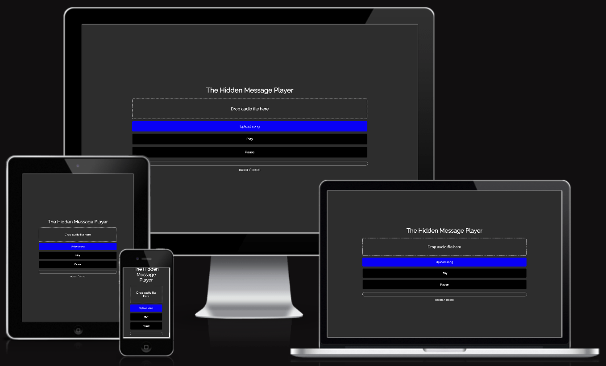
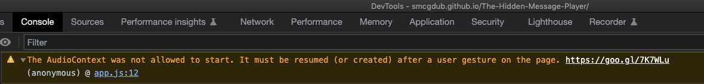

# **The 33rpm Player Testing Information** #

### **1. Testing** ###

* 1.1 HTML Code Validating 
* 1.2 CSS Code Validating 
* 1.3 JavaScript Code Validating

**1.1 HTML Code Validating**

* All of the HTML files were tested on the [W3C HTML Markup Validation website](https://validator.w3.org/)
* All of the files came back clear with the result of **"Document checking completed. No errors or warnings to show"**

**1.2 CSS Code Validating**

* The main CSS files were tested on the [W3C CSS  Validation website](https://jigsaw.w3.org/css-validator/) 
* All of the files came back clear with the result of **"Congratulations! No Error Found."**

**1.3 Javascript Code Validating**

* The testing for the app.js file was carried out on [JShint.com](https://jshint.com/) 
* The Javascript came back with zero errors in the code. 

**Console Testing**

I also checked the dev tools console in Google Chrome when running the page on the live site. There were no errors but there was 1 warning error which said: 

<strong>"The AudioContext was not allowed to start. It must be resumed (or created) after a user gesture on the page."</strong> 

I researched this error and found that it is a common error when using the AudioContext API. It is not an error that will affect the functionality of the app. I have noted it here for future reference but for now as it does not affect the functionality I will leave it as it is.